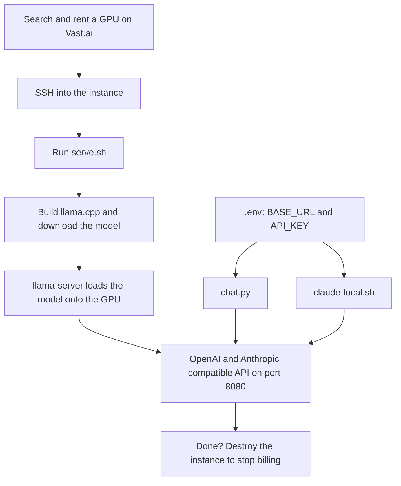

# cloud-gpu-llm

Run any local model on a rented GPU.

```mermaid
flowchart TD
    A["Search and rent a GPU on Vast.ai"] --> B["SSH into the instance"]
    B --> C["Run serve.sh"]
    C --> D["Build llama.cpp and download the model"]
    D --> E["llama-server loads the model onto the GPU"]
    E --> F["OpenAI and Anthropic compatible API on port 8080"]
    G[".env: BASE_URL and API_KEY"] --> H["chat.py"]
    G --> I["claude-local.sh"]
    H --> F
    I --> F
    F --> J["Done? Destroy the instance to stop billing"]
```
